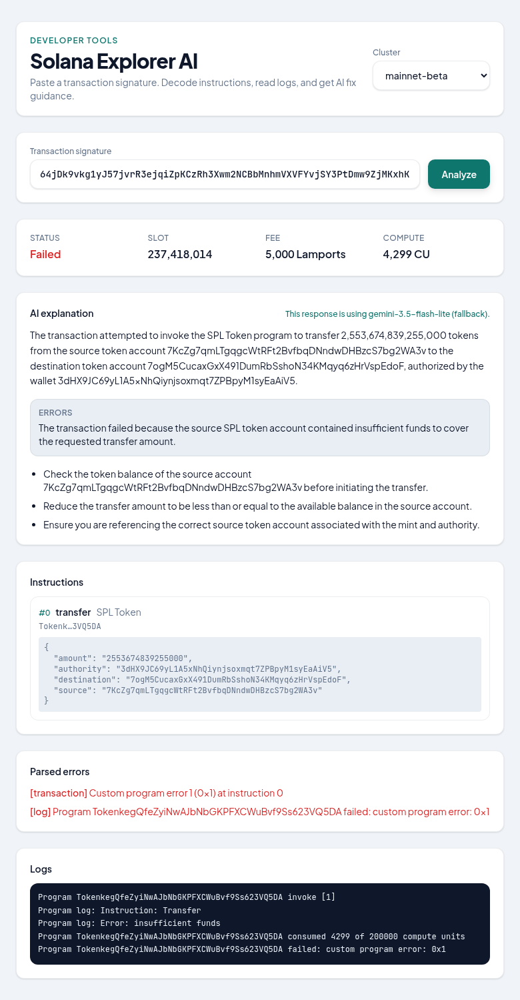
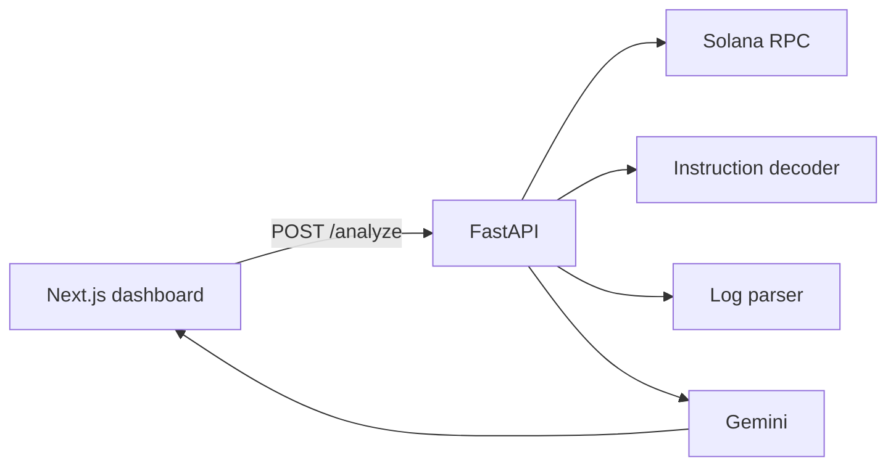

# Solana Explorer AI

Signature → decode → logs → Gemini fixes. Portfolio / lab — not a full indexer.

**Live demo:** https://docmind.ahmadmaulana.net/

[](https://github.com/Ah-Riz/docmind/actions/workflows/ci.yml)
[](LICENSE)

## Recruiter takeaway

> Builds Solana tooling end to end: RPC fetch, instruction decoding, log analysis, and structured LLM explanations — not a chat wrapper over explorer links.

**Career targets:** Solana Engineer · AI Engineer · Full-stack Engineer

**Success criteria:** A reviewer concludes the author can debug on-chain failures and explain them to developers.

## Try it

Open the [live demo](https://docmind.ahmadmaulana.net/), keep **mainnet-beta**, paste a signature, click **Analyze**.

| Cluster | Signature | What you should see |
|---------|-----------|---------------------|
| mainnet-beta | `64jDk9vkg1yJ57jvrR3ejqiZpKCzRh3Xwm2NCBbMnhmVXVFYvjSY3PtDmw9ZjMKxhK3jjVnNXnK1h9hWWnGi8Wve` | **Failed** SPL Token transfer — insufficient funds, custom error `0x1` |



Honest framing: portfolio shaped like production. Not an IDL registry or historical indexer. Focus is the debug loop.

## Architecture

See [docs/architecture.md](docs/architecture.md).



## Stack

| Layer | Choices |
|-------|---------|
| Backend | FastAPI, httpx, Google GenAI (Gemini) |
| Chain | Public Solana RPC (overridable) |
| Frontend | Next.js 14 static export, Tailwind, Elevated Tosca |
| Deploy | Cloudflare Pages (UI), Render (API) |
| Ops | Docker Compose, pytest, GitHub Actions |

## Quick start

```bash
cp .env.example .env
# set GEMINI_API_KEY

cd backend && python -m venv .venv && source .venv/bin/activate
pip install -r requirements.txt
uvicorn app.main:app --reload --port 8001

cd ../frontend && npm install && npm run dev
```

Or: `docker compose up --build` for the API.

```bash
curl -X POST http://localhost:8001/analyze \
  -H "Content-Type: application/json" \
  -d '{"signature":"64jDk9vkg1yJ57jvrR3ejqiZpKCzRh3Xwm2NCBbMnhmVXVFYvjSY3PtDmw9ZjMKxhK3jjVnNXnK1h9hWWnGi8Wve","cluster":"mainnet-beta"}'
```

## Tests

```bash
cd backend && source .venv/bin/activate
pytest -q
```

RPC and Gemini are mocked. CI runs the same suite on every push/PR.

## What I own

- Solana RPC client (`getTransaction`, clear error messages)
- Instruction decode (System, SPL Token, Compute Budget, ATA, Memo, Anchor discriminators)
- Log / `meta.err` / custom program error extraction
- Gemini explanation with model fallback chain
- FastAPI `/health` + `/analyze`
- Next.js developer dashboard
- Docker Compose, pytest (including golden failed-tx fixture), Cloudflare Pages + Render deploy docs

## Out of scope

- Custom IDL upload UI
- Wallet connect
- Historical account indexing
- Multi-tenant auth

## Deploy

Production: **https://docmind.ahmadmaulana.net/** (API on Render). Steps: [docs/deploy.md](docs/deploy.md).

## License

MIT — see [LICENSE](LICENSE)
