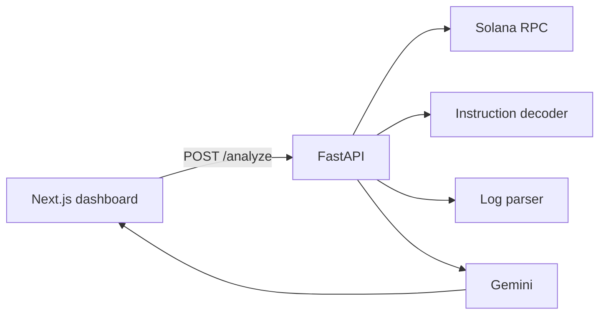

# Solana Explorer AI

## Recruiter takeaway

> Builds Solana tooling end to end: RPC fetch, instruction decoding, log analysis, and structured LLM explanations — not a chat wrapper over explorer links.

**Career targets:** Solana Engineer · AI Engineer · Full-stack Engineer

**Success criteria:** A reviewer concludes the author can debug on-chain failures and explain them to developers.

---

## Honest framing

Portfolio / lab project shaped like production. Not a full indexer or IDL registry. The focus is the debug loop: signature → decode → errors → AI fixes.

## Problem

Failed Solana transactions hide the useful signal in raw logs and custom program errors. Developers need a short path from a signature to what broke and what to try next.

```
Signature → Solana RPC → decode ix + parse logs → Gemini → flow / errors / fixes
```

## MVP features

- Fetch transaction by signature (mainnet-beta / devnet / testnet)
- Decode System, SPL Token, Compute Budget, ATA, Memo, Anchor discriminators
- Extract instruction and custom program errors from meta + logs
- AI explanation: transaction flow, error summary, fix recommendations
- Elevated Tosca developer dashboard (Next.js)
- Docker, tests, Cloudflare Pages + Render deploy docs

## Architecture

See [docs/architecture.md](docs/architecture.md).



## Tech stack

| Layer | Choices |
|-------|---------|
| Backend | FastAPI, httpx, Google GenAI (Gemini) |
| Chain | Public Solana RPC (overridable) |
| Frontend | Next.js 14 static export, Tailwind, Elevated Tosca |
| Deploy | Cloudflare Pages (UI), Render (API) |
| Ops | Docker Compose, pytest |

## API example

```bash
curl -X POST http://localhost:8001/analyze \
  -H "Content-Type: application/json" \
  -d '{"signature":"<BASE58_SIG>","cluster":"mainnet-beta"}'
```

Requires `GEMINI_API_KEY` on the server.

## Installation

```bash
cp .env.example .env
# set GEMINI_API_KEY

cd backend && python -m venv .venv && source .venv/bin/activate
pip install -r requirements.txt
uvicorn app.main:app --reload --port 8001

cd ../frontend && npm install && npm run dev
```

Or: `docker compose up --build` for the API.

Deploy steps: [docs/deploy.md](docs/deploy.md).

## Tests

```bash
cd backend && source .venv/bin/activate
pytest -q
```

RPC and Gemini are mocked in tests.

## Out of scope (MVP)

- Custom IDL upload UI
- Wallet connect
- Historical account indexing
- Multi-tenant auth

## License

MIT — see [LICENSE](LICENSE)
